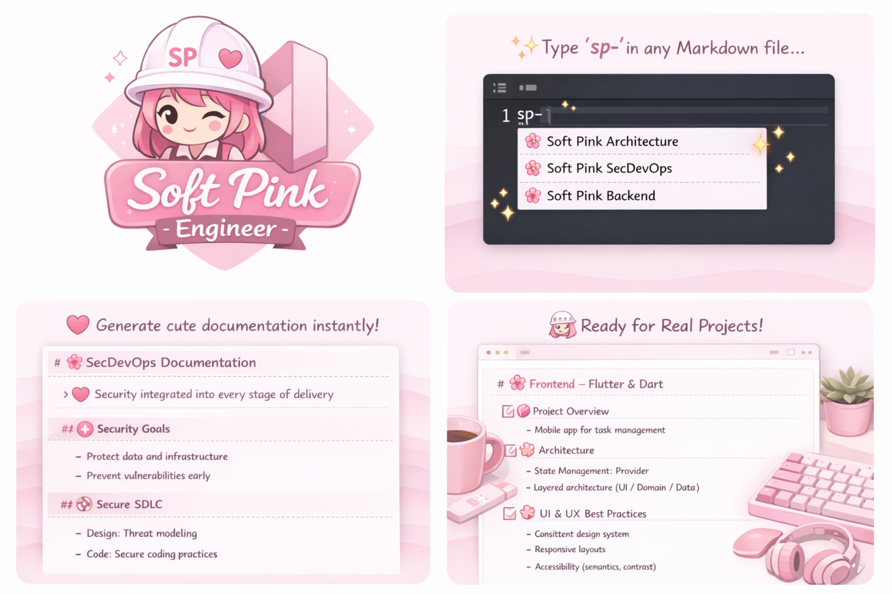

# 🎀 Soft Pink Engineer

💗 Cute & professional Markdown templates for engineering students.

## ✨ Features
- Cloud Architecture
- Terraform Projects
- CI/CD Pipelines
- Observability
- Postmortems
- Production Checklists

## 🌸 How to use
Type `sp-` inside a Markdown file and choose a template.

1. Open a file in VS Code (for example, `.md`).
3. Type `sp-`.
4. Press **Ctrl + Space** (or **Cmd + Space** on Mac) to trigger the autocomplete.
5. You should see your extension's snippets or commands appear in the suggestion list.
6. Select the snippet or command to insert it into the file.

## 👩‍💻 Who is this for?
- Students
- Junior engineers
- DevOps & Cloud learners

## 💗 Style
Soft pink, clean structure, senior-ready documentation.
